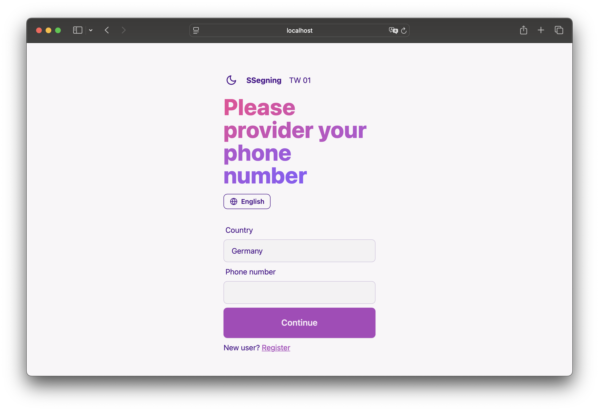

# Keycloak Phone Number Login Plugin

This plugin helps you to login by phone number.

| Keycloak Version | Plugin Version |
|------------------|----------------|
| 21               | ✅ 1.1.0        |
| 22               | ✅ 26.1.3       |
| 23               | ✅ 26.1.3       |
| 24               | ✅ 26.1.3       |
| 25               | ✅ 26.1.3       |
| 26               | ✅ 26.1.3       |



## 1. What It Is

The **Keycloak Phone Number Login Plugin** is a custom extension for Keycloak that enables authentication via SMS-based
phone number login. Instead of (or in addition to) traditional username/password logins, this plugin allows end-users to
authenticate using their phone number. The process includes:

- **Phone Number Entry:** Users enter their phone number.
- **Confirmation:** The system displays a formatted version of the number for user confirmation.
- **User Lookup/Creation:** The plugin checks if the user exists (creating one if not).
- **SMS TAN Sending:** A Transaction Authentication Number (TAN) is generated and sent via an external SMS API.
- **TAN Validation:** The user inputs the TAN to complete authentication.
- **Profile Update:** On successful TAN verification, users can update their profile information.

This modular plugin uses a multi-step flow and is designed with separation of concerns in mind, using a dedicated
service layer for SMS and phone number processing.

## New Feature: OAuth2 Authentication for SMS Service

The `SmsService` has been refactored to replace **Basic Authentication** with **OAuth2 Client Credentials Grant** for secure communication with the SMS provider.  

The plugin now fetches an **access token** from a `/token` endpoint, using it for `/sms/send` and `/sms/validate` API calls.

---

## 2. How to Use It

### Downloading the Plugin

You can download the latest plugin JAR from the GitHub artifacts using a `curl` command. For example:

```bash
curl -L -o keycloak-phonenumber-login.jar https://github.com/vymalo/keycloak-phone-number/releases/download/v<version>/keycloak-phonenumber-login-<version>.jar
```

### Mounting into Keycloak

Once you have the JAR, mount it into the Keycloak server. For example, when running Keycloak in Docker, you can mount
the plugin as a volume:

#### Docker Example

```bash
docker run -d \
  --name keycloak \
  -p 8080:8080 \
  -e KEYCLOAK_ADMIN=admin \
  -e KEYCLOAK_ADMIN_PASSWORD=password \
  -e SMS_API_URL=http://your-sms-api-url \
  -e SMS_API_COUNTRY_PATTERN='cm|de|fr' \
  -e OAUTH2_CLIENT_ID=some-client-id \
  -e OAUTH2_CLIENT_SECRET=some-cient-secret \
  -e OAUTH2_TOKEN_ENDPOINT=http://your-sms-api-url/token \
  -v /path/to/keycloak-phonenumber-login.jar:/opt/keycloak/providers/keycloak-phonenumber-login.jar \
  quay.io/keycloak/keycloak:26.1.2 start-dev
```

#### Kubernetes Example

```yaml
apiVersion: apps/v1
kind: Deployment
metadata:
  name: keycloak
spec:
  replicas: 1
  selector:
    matchLabels:
      app: keycloak
  template:
    metadata:
      labels:
        app: keycloak
    spec:
      volumes:
        - name: plugin-volume
          emptyDir: {}
      initContainers:
        - name: download-plugin
          image: curlimages/curl:8.1.2
          env:
            - name: VERSION
              value: 26.1.3
          command:
            - sh
            - -c
            - |
              curl -L -o /plugin/keycloak-phonenumber-login.jar https://github.com/vymalo/keycloak-phone-number/releases/download/v$VERSION/keycloak-phonenumber-login-$VERSION.jar
          volumeMounts:
            - name: plugin-volume
              mountPath: /plugin
      containers:
        - name: keycloak
          image: quay.io/keycloak/keycloak:26.1.2
          ports:
            - containerPort: 8080
          env:
            - name: KEYCLOAK_ADMIN
              value: "admin"
            - name: KEYCLOAK_ADMIN_PASSWORD
              value: "password"
            - name: SMS_API_URL
              value: "http://your-sms-api-url"
            - name: SMS_API_COUNTRY_PATTERN
              value: "cm|de|fr"
            - name: OAUTH2_CLIENT_ID
              value: "some-client-id"
            - name: OAUTH2_CLIENT_SECRET
              value: "some-client-secret"
            - name: OAUTH2_TOKEN_ENDPOINT
              value: "http://your-sms-api-url/token"
          volumeMounts:
            - name: plugin-volume
              mountPath: /opt/keycloak/providers
```

*Tip:* For Kubernetes, it's more common to use a sidecar or init container to download the plugin from GitHub and copy
it into the appropriate directory.

---

## 3. Environment Variables

The following environment variables are used by the plugin:

- **KEYCLOAK_ADMIN**: The administrator username for Keycloak.  
- **KEYCLOAK_ADMIN_PASSWORD**: The administrator password for Keycloak.  
- **KC_LOG_CONSOLE_COLOR**: Enables colored logging in the console (set to `'true'` or `'false'`).  
- **KC_HTTP_PORT**: The HTTP port on which Keycloak runs.  
- **SMS_API_URL**: The base URL of the SMS API service.  
- **SMS_API_COUNTRY_PATTERN**: A regex pattern to match supported phone number country codes.  
- **OAUTH2_CLIENT_ID**: The client ID for OAuth2 authentication with the SMS provider.  
- **OAUTH2_CLIENT_SECRET**: The client secret for OAuth2 authentication with the SMS provider.  
- **OAUTH2_TOKEN_ENDPOINT**: The URL of the token endpoint for OAuth2 authentication (e.g., `http://your-sms-api-url/token`).  

**Note**: The older `SMS_API_AUTH_USERNAME` and `SMS_API_AUTH_PASSWORD` variables are **deprecated** and replaced with the above OAuth2 variables for enhanced security.  

Configure these variables in your deployment (Docker, Kubernetes, etc.) as shown in the examples above.  

---

## 4. Architecture

The plugin is built using a multi-module Maven structure with the following layers:

- **Core Module:**  
  Contains shared constants, utilities, and models (e.g., phone number helpers, country codes).

- **Authenticator Module:**  
  Implements custom Keycloak authenticators that control the multi-step authentication flow:
    - **PhoneNumberGetNumber:** Collects user phone numbers.
    - **PhoneNumberConfirmNumber:** Displays the confirmed phone number.
    - **PhoneNumberChooseUser:** Looks up or creates users based on phone number.
    - **PhoneNumberSendTan:** Sends a TAN via an SMS service.
    - **PhoneNumberValidateTan:** Validates the TAN entered by the user.
    - **PhoneNumberUpdateUser:** Prompts users to update their profile post-authentication.

- **Service Module:**  
  Encapsulates business logic for phone number processing and SMS operations:
    - **PhoneNumberService:** Validates and formats phone numbers.
    - **SmsService:** Handles interactions with the external SMS API (using an OpenAPI-generated client).

- **OpenAPI Client Module:**  
  Contains the generated client code for the SMS API integration, ensuring a robust and type-safe communication with the
  external service.

Dependency injection (via CDI) is used to wire components together, making the system more modular, testable, and
maintainable.

---

## 5. Contribute

We welcome contributions! Here’s how you can get involved:

### Reporting Issues

- Use the GitHub issues page to report bugs, suggest enhancements, or request features.
- Ensure your issue includes detailed reproduction steps and relevant logs.

### Contributing Code

- **Fork the Repository:**  
  Create a fork, then clone it locally.
- **Branching Model:**
    - Use feature branches for new features or fixes.
    - Ensure your branch name is descriptive (e.g., `feature/sms-service-refactor`).
- **Coding Standards:**  
  Follow the existing coding conventions.
    - Write unit tests for your changes.
    - Run `mvn clean install` and ensure all tests pass.
- **Pull Requests:**  
  Submit a pull request with a clear description of your changes, referencing any issues addressed.

### Documentation & Feedback

- Update documentation as needed with your changes.
- Provide feedback on areas for improvement or additional features.

---

*For more details or questions, please contact [dev@ssegning.com](mailto:dev@ssegning.com).*